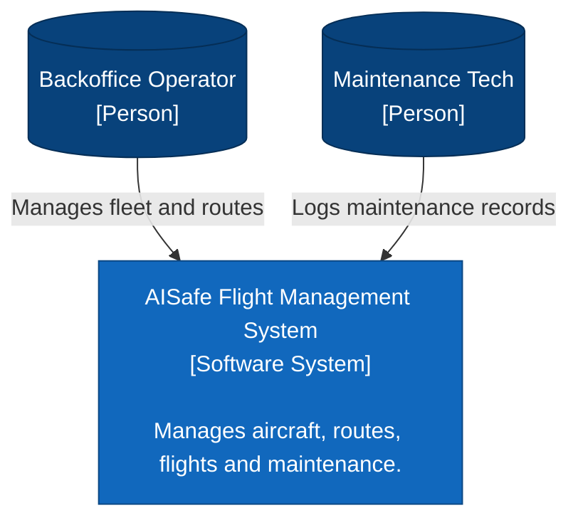
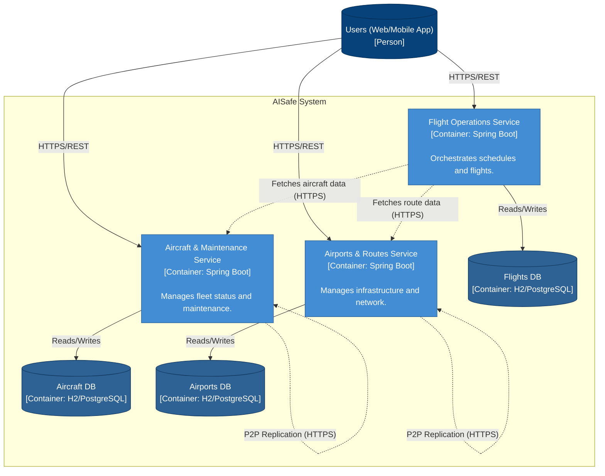
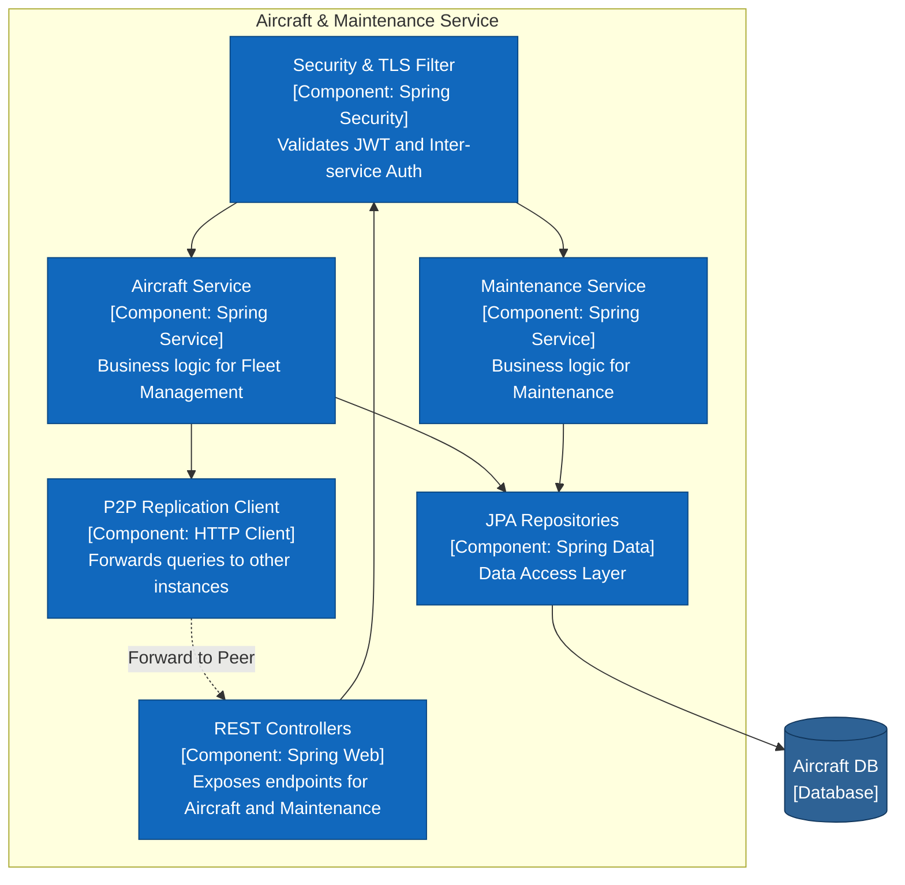
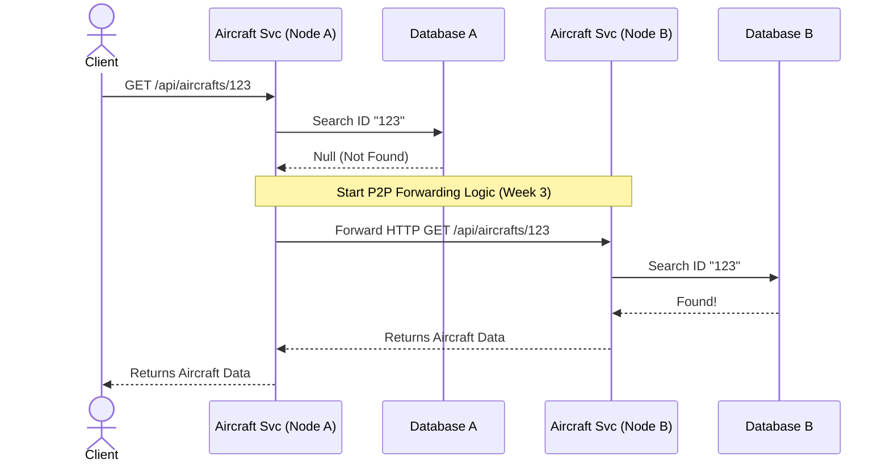

# AISafe Flight Management System - C4 Architecture Model

This document outlines the software architecture of the AISafe distributed system using the C4 model.

## Level 1: System Context
This diagram shows the high-level view of the AISafe system and its users.

## Level 2: Container Diagram
This diagram shows the microservices architecture that makes up the AISafe system, reflecting the Domain-Driven Segregation.

## Level 3: Component Diagram (Aircraft & Maintenance Service)
Focusing specifically on your service (Aircraft & Maintenance).

## The "+1": Dynamic Behavior (Sequence Diagram)
The **C4+1** model combines the static architecture (C4) with Kruchten's "4+1" view model, where the "+1" represents the **Scenarios / Use Cases (Dynamic Behavior)**. 
To meet the SIDIS requirements, this diagram documents the most complex dynamic scenario of the project: the **HTTP Forwarding (P2P)** from *Week 3*.

