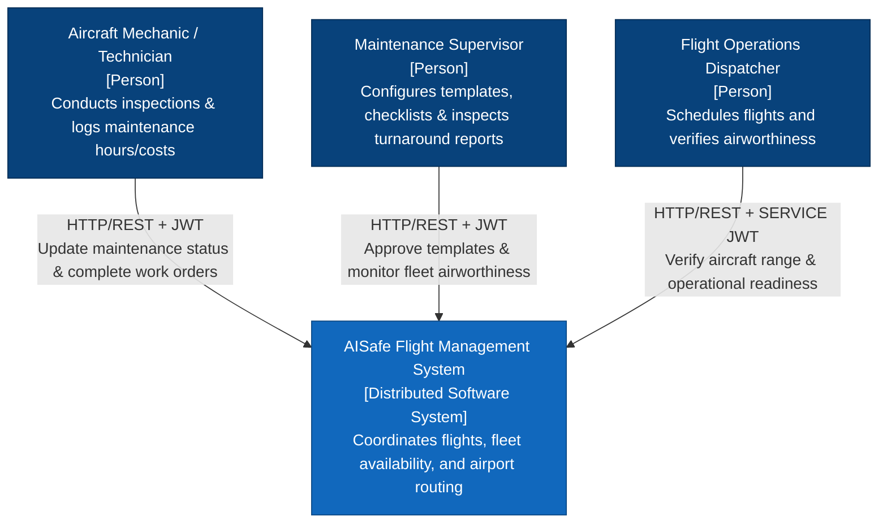
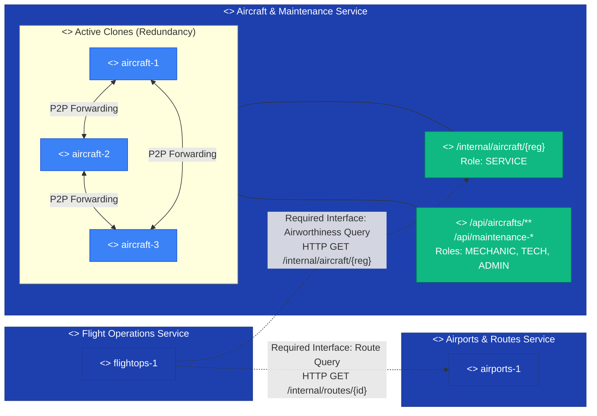
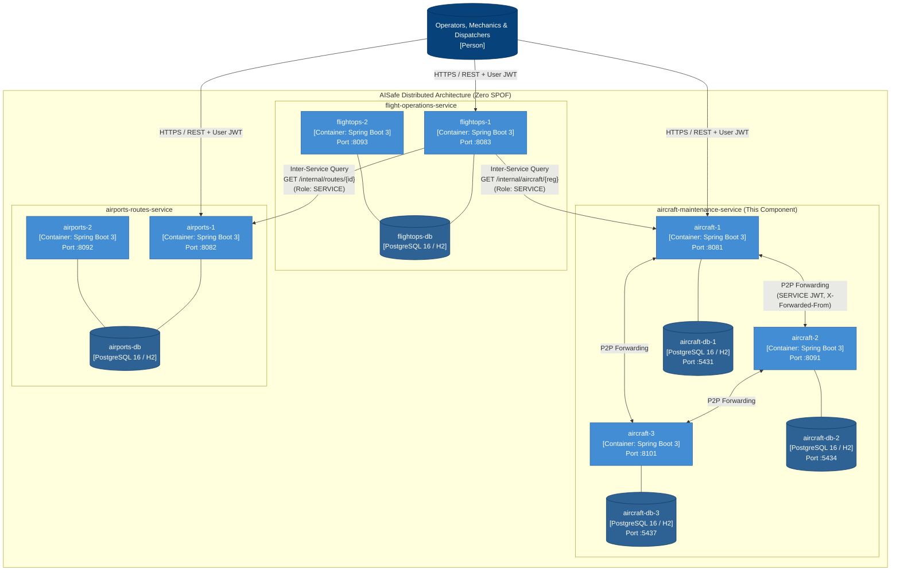
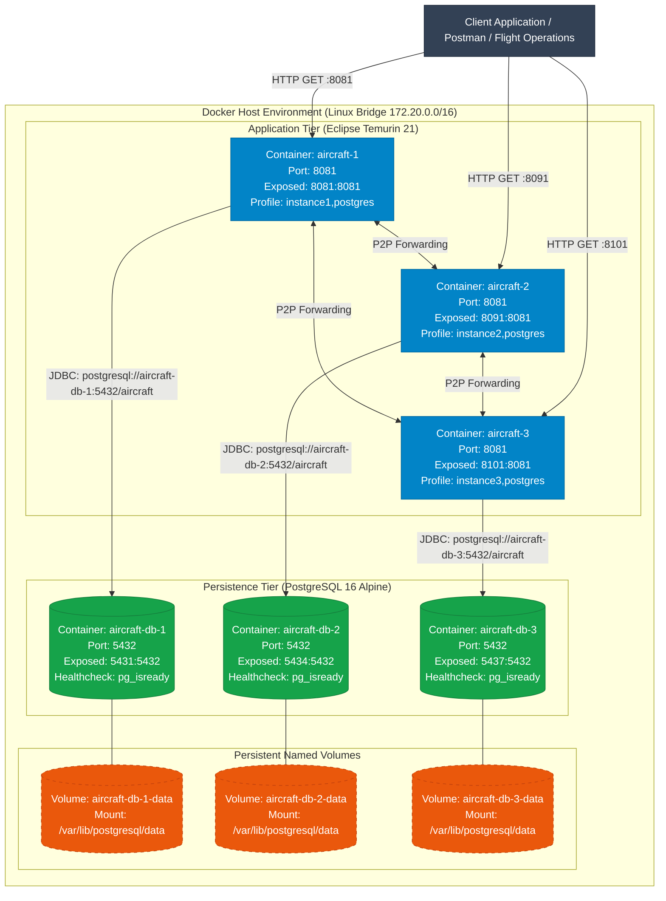
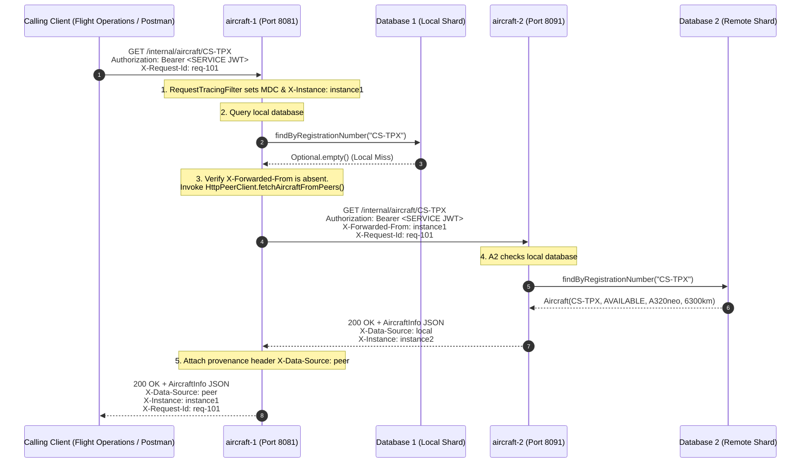
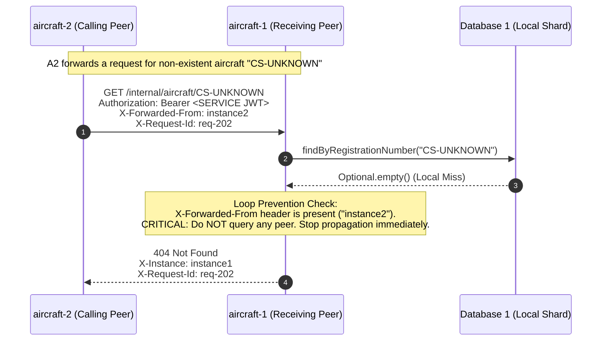

# AISafe Flight Management System - C4+1 Architectural Model
**Component**: `aircraft-maintenance-service`  
**Course**: Sistemas Distribuídos (LETI-SIDIS 2026/27)  
**Author**: André (1240567)  

**Contents:** [Level 1: Context](#level-1-system-context-diagram) · [UML Logical View](#uml-logical-view-level-1-deployment-independent-component-model) · [Level 2: Containers](#level-2-container-diagram-domain-driven-segregation) · [Level 3: Components](#level-3-component-diagram-inside-aircraft-maintenance-service) · [Deployment View](#level-4-deployment-view-multi-instance-docker-deployment) · [Dynamic Scenarios (+1)](#the-1-dynamic-distributed-behavior-sequence-diagrams)

---

## 1. Introduction & Notation

This document formalizes the architectural design of the **Aircraft & Maintenance Service** using the **C4 model** (Context, Containers, Components, Code) originated by Simon Brown, combined with the dynamic "+1" scenarios of Philippe Kruchten's **4+1 View Model** (IEEE Software, 1995).

---

## Level 1: System Context Diagram

Visualizes the high-level boundaries of the AISafe distributed system, human actors, and the operational responsibilities of the maintenance division.

```mermaid
%% C4 Level 1 - System Context
flowchart TB
    classDef person fill:#08427b,stroke:#052e56,color:#fff;
    classDef system fill:#1168bd,stroke:#0b4884,color:#fff;

    mech["Aircraft Mechanic / Technician<br/>[Person]<br/>Conducts inspections & logs maintenance hours/costs"]:::person
    sup["Maintenance Supervisor<br/>[Person]<br/>Configures templates, checklists & inspects turnaround reports"]:::person
    disp["Flight Operations Dispatcher<br/>[Person]<br/>Schedules flights and verifies airworthiness"]:::person

    aisafe["AISafe Flight Management System<br/>[Distributed Software System]<br/>Coordinates flights, fleet availability, and airport routing"]:::system

    mech -->|"HTTP/REST + JWT<br/>Update maintenance status & complete work orders"| aisafe
    sup -->|"HTTP/REST + JWT<br/>Approve templates & monitor fleet airworthiness"| aisafe
    disp -->|"HTTP/REST + SERVICE JWT<br/>Verify aircraft range & operational readiness"| aisafe
```

---

## UML Logical View Level 1 (Deployment-Independent Component Model)

Following the formal specification in *Testing Component Collaboration, Cloning, UML Logical View Level 1* (Prof. Orlando Sousa, Week 4 Practical Session, Slides 14–15):

* **Components (`<<component>>`):** Captures high-level service boundaries and functional autonomy regardless of physical deployment.
* **Instances (`<<instance>>`):** Visualizes redundancy and active cloning (`aircraft-1`, `aircraft-2`) to eliminate single points of failure.
* **Interfaces & Endpoints:** Explicitly represents provided interfaces (Lollipop / REST endpoints) and required interfaces (Socket / REST client dependencies).
* **Dependencies:** Directed dependencies illustrating inter-service collaboration and unicast peer forwarding.

```mermaid
%% UML Logical View Level 1 (Deployment-Independent Structural Model)
flowchart LR
    classDef comp fill:#1e40af,stroke:#1e3a8a,color:#fff;
    classDef inst fill:#3b82f6,stroke:#1d4ed8,color:#fff;
    classDef iface fill:#10b981,stroke:#047857,color:#fff;

    subgraph AM_Comp["<<component>> Aircraft & Maintenance Service"]
        direction TB
        subgraph AM_Clones["<<instance>> Active Clones (Redundancy)"]
            amInst1["<<instance>> aircraft-1"]:::inst
            amInst2["<<instance>> aircraft-2"]:::inst
            amInst3["<<instance>> aircraft-3"]:::inst
            amInst1 <-->|"P2P Forwarding"| amInst2
            amInst2 <-->|"P2P Forwarding"| amInst3
            amInst1 <-->|"P2P Forwarding"| amInst3
        end

        iInternal["<<interface>> /internal/aircraft/{reg}<br/>Role: SERVICE"]:::iface
        iPublic["<<interface>> /api/aircrafts/**<br/>/api/maintenance-*<br/>Roles: MECHANIC, TECH, ADMIN"]:::iface

        AM_Clones --- iInternal
        AM_Clones --- iPublic
    end

    subgraph FO_Comp["<<component>> Flight Operations Service"]
        foInst["<<instance>> flightops-1"]:::comp
    end

    subgraph AR_Comp["<<component>> Airports & Routes Service"]
        arInst["<<instance>> airports-1"]:::comp
    end

    foInst -.->|"Required Interface: Airworthiness Query<br/>HTTP GET /internal/aircraft/{reg}"| iInternal
    foInst -.->|"Required Interface: Route Query<br/>HTTP GET /internal/routes/{id}"| arInst

    class AM_Comp comp;
    class FO_Comp comp;
    class AR_Comp comp;
```

---

## Level 2: Container Diagram (Domain-Driven Segregation)

Illustrates the decomposition of the original PSOFT monolith into three autonomous, domain-aligned microservices, highlighting active component cloning and isolated databases.

```mermaid
%% C4 Level 2 - Container Diagram
flowchart TB
    classDef person fill:#08427b,stroke:#052e56,color:#fff;
    classDef container fill:#438dd5,stroke:#2e6295,color:#fff;
    classDef db fill:#2e6295,stroke:#11365c,color:#fff,shape:cylinder;

    Users[("Operators, Mechanics & Dispatchers<br/>[Person]")]:::person

    subgraph AISafe["AISafe Distributed Architecture (Zero SPOF)"]
        subgraph AM_Cluster["aircraft-maintenance-service (This Component)"]
            am1["aircraft-1<br/>[Container: Spring Boot 3]<br/>Port :8081"]:::container
            am2["aircraft-2<br/>[Container: Spring Boot 3]<br/>Port :8091"]:::container
            am3["aircraft-3<br/>[Container: Spring Boot 3]<br/>Port :8101"]:::container
            db_am1[("aircraft-db-1<br/>[PostgreSQL 16 / H2]<br/>Port :5431")]:::db
            db_am2[("aircraft-db-2<br/>[PostgreSQL 16 / H2]<br/>Port :5434")]:::db
            db_am3[("aircraft-db-3<br/>[PostgreSQL 16 / H2]<br/>Port :5437")]:::db
            am1 --- db_am1
            am2 --- db_am2
            am3 --- db_am3
            am1 <-->|"P2P Forwarding<br/>(SERVICE JWT, X-Forwarded-From)"| am2
            am2 <-->|"P2P Forwarding"| am3
            am1 <-->|"P2P Forwarding"| am3
        end

        subgraph FO_Cluster["flight-operations-service"]
            fo1["flightops-1<br/>[Container: Spring Boot 3]<br/>Port :8083"]:::container
            fo2["flightops-2<br/>[Container: Spring Boot 3]<br/>Port :8093"]:::container
            db_fo[("flightops-db<br/>[PostgreSQL 16 / H2]")]:::db
            fo1 --- db_fo
            fo2 --- db_fo
        end

        subgraph AR_Cluster["airports-routes-service"]
            ar1["airports-1<br/>[Container: Spring Boot 3]<br/>Port :8082"]:::container
            ar2["airports-2<br/>[Container: Spring Boot 3]<br/>Port :8092"]:::container
            db_ar[("airports-db<br/>[PostgreSQL 16 / H2]")]:::db
            ar1 --- db_ar
            ar2 --- db_ar
        end
    end

    Users -->|"HTTPS / REST + User JWT"| am1
    Users -->|"HTTPS / REST + User JWT"| fo1
    Users -->|"HTTPS / REST + User JWT"| ar1

    fo1 -->|"Inter-Service Query<br/>GET /internal/aircraft/{reg}<br/>(Role: SERVICE)"| am1
    fo1 -->|"Inter-Service Query<br/>GET /internal/routes/{id}<br/>(Role: SERVICE)"| ar1
```

---

## Level 3: Component Diagram (Inside an `aircraft-maintenance-service` Instance)

Details the internal components of a single instance, including the security and distributed tracing filter chain, REST controllers, domain services, P2P peer client, and data persistence repositories.

```mermaid
%% C4 Level 3 - Component Diagram
flowchart TB
    classDef filter fill:#d97706,stroke:#92400e,color:#fff;
    classDef ctrl fill:#1168bd,stroke:#0b4884,color:#fff;
    classDef svc fill:#2563eb,stroke:#1d4ed8,color:#fff;
    classDef repo fill:#475569,stroke:#1e293b,color:#fff;
    classDef db fill:#1e3a8a,stroke:#172554,color:#fff,shape:cylinder;

    dbEngine[("Isolated DB<br/>[H2 / PostgreSQL 16]")]:::db

    subgraph Instance["aircraft-maintenance-service Instance"]
        subgraph Pipeline["Filter Chain (Ordered)"]
            direction LR
            fTrace["RequestTracingFilter<br/>(Order: HIGHEST)<br/>X-Request-Id, X-Instance, MDC"]:::filter
            fAuth["AuthTokenFilter<br/>JWT parsing & validation"]:::filter
            fAudit["AuditLogFilter<br/>Non-repudiation audit logging"]:::filter
            fTrace --> fAuth --> fAudit
        end

        subgraph Controllers["REST Presentation Layer"]
            direction TB
            cInternal["InternalAircraftController<br/>Handles /internal/aircraft/{reg}<br/>Enforces SERVICE role & P2P forwarding"]:::ctrl
            cAircraft["AircraftController<br/>Handles /api/aircrafts/**<br/>Roles: MECHANIC, ADMIN"]:::ctrl
            cTemplate["MaintenanceTemplateController<br/>Handles /api/maintenance-templates/**<br/>Roles: TECHNICIAN, SUPERVISOR"]:::ctrl
            cRecord["MaintenanceRecordController<br/>Handles /api/maintenance-records/**<br/>Roles: TECHNICIAN, SUPERVISOR"]:::ctrl
        end

        subgraph Core["Domain Services & Peer Coordination"]
            direction TB
            sAircraft["AircraftService<br/>Fleet lifecycle & flight hours tracking"]:::svc
            sTemplate["MaintenanceTemplateService<br/>Checklist definitions & model applicability"]:::svc
            sRecord["MaintenanceRecordService<br/>Work order lifecycle, turnaround & cost calculations"]:::svc
            sPeer["HttpPeerClient<br/>Unicast HTTP GET with connect/read timeout"]:::svc
            cfgCluster["ClusterConfig<br/>Self identity & Peer URLs"]:::svc
        end

        subgraph Repos["Data Access Layer (Spring Data JPA)"]
            direction LR
            rAircraft[("AircraftRepository")]:::repo
            rModel[("AircraftModelRepository")]:::repo
            rTemplate[("MaintenanceTemplateRepository")]:::repo
            rRecord[("MaintenanceRecordRepository")]:::repo
        end
    end

    Pipeline --> Controllers

    cInternal --> rAircraft
    cInternal --> sPeer
    sPeer --> cfgCluster
    sPeer -->|"Unicast HTTP GET<br/>X-Forwarded-From / SERVICE JWT"| extPeer(["Peer Replica Instance"])

    cAircraft --> sAircraft
    cTemplate --> sTemplate
    cRecord --> sRecord

    sAircraft --> rAircraft
    sAircraft --> rModel
    sTemplate --> rTemplate
    sTemplate --> rModel
    sRecord --> rRecord
    sRecord --> rAircraft
    sRecord --> rTemplate

    rAircraft --- dbEngine
    rModel --- dbEngine
    rTemplate --- dbEngine
    rRecord --- dbEngine
```

---

## Level 4: Deployment Diagram (Physical & Virtual Container Topology)

Details the physical/virtual deployment architecture within Docker, illustrating listening ports, network aliases, and dedicated storage volumes.

```mermaid
%% C4 Level 4 - Deployment Diagram
flowchart TB
    classDef client fill:#334155,stroke:#1e293b,color:#fff;
    classDef app fill:#0284c7,stroke:#0369a1,color:#fff;
    classDef db fill:#16a34a,stroke:#15803d,color:#fff;
    classDef vol fill:#ea580c,stroke:#c2410c,color:#fff,stroke-dasharray: 5 5;

    clientNode["Client Application / Postman / Flight Operations"]:::client

    subgraph DockerHost["Docker Host Environment (Linux Bridge 172.20.0.0/16)"]
        subgraph AppCluster["Application Tier (Eclipse Temurin 21)"]
            inst1["Container: aircraft-1<br/>Port: 8081<br/>Exposed: 8081:8081<br/>Profile: instance1,postgres"]:::app
            inst2["Container: aircraft-2<br/>Port: 8081<br/>Exposed: 8091:8081<br/>Profile: instance2,postgres"]:::app
            inst3["Container: aircraft-3<br/>Port: 8081<br/>Exposed: 8101:8081<br/>Profile: instance3,postgres"]:::app
        end

        subgraph DBCluster["Persistence Tier (PostgreSQL 16 Alpine)"]
            db1[("Container: aircraft-db-1<br/>Port: 5432<br/>Exposed: 5431:5432<br/>Healthcheck: pg_isready")]:::db
            db2[("Container: aircraft-db-2<br/>Port: 5432<br/>Exposed: 5434:5432<br/>Healthcheck: pg_isready")]:::db
            db3[("Container: aircraft-db-3<br/>Port: 5432<br/>Exposed: 5437:5432<br/>Healthcheck: pg_isready")]:::db
        end

        subgraph VolumeTier["Persistent Named Volumes"]
            v1[("Volume: aircraft-db-1-data<br/>Mount: /var/lib/postgresql/data")]:::vol
            v2[("Volume: aircraft-db-2-data<br/>Mount: /var/lib/postgresql/data")]:::vol
            v3[("Volume: aircraft-db-3-data<br/>Mount: /var/lib/postgresql/data")]:::vol
        end
    end

    clientNode -->|"HTTP GET :8081"| inst1
    clientNode -->|"HTTP GET :8091"| inst2
    clientNode -->|"HTTP GET :8101"| inst3

    inst1 <-->|"P2P Forwarding"| inst2
    inst2 <-->|"P2P Forwarding"| inst3
    inst1 <-->|"P2P Forwarding"| inst3

    inst1 -->|"JDBC: postgresql://aircraft-db-1:5432/aircraft"| db1
    inst2 -->|"JDBC: postgresql://aircraft-db-2:5432/aircraft"| db2
    inst3 -->|"JDBC: postgresql://aircraft-db-3:5432/aircraft"| db3

    db1 --- v1
    db2 --- v2
    db3 --- v3
```

---

## The "+1": Dynamic Distributed Behavior (Sequence Diagrams)

### Scenario 1: P2P Unicast Query Forwarding Across Replicas
Demonstrates how Instance 1 satisfies a query for partition `CS-TPX` (residing natively on Instance 2) while attaching correlation and provenance headers.

```mermaid
%% Sequence Diagram: P2P Query Forwarding
sequenceDiagram
    autonumber
    participant Caller as Calling Client (Flight Operations / Postman)
    participant A1 as aircraft-1 (Port 8081)
    participant DB1 as Database 1 (Local Shard)
    participant A2 as aircraft-2 (Port 8091)
    participant DB2 as Database 2 (Remote Shard)

    Caller->>A1: GET /internal/aircraft/CS-TPX<br/>Authorization: Bearer <SERVICE JWT><br/>X-Request-Id: req-101
    
    Note over A1: 1. RequestTracingFilter sets MDC & X-Instance: instance1
    Note over A1: 2. Query local database
    A1->>DB1: findByRegistrationNumber("CS-TPX")
    DB1-->>A1: Optional.empty() (Local Miss)

    Note over A1: 3. Verify X-Forwarded-From is absent.<br/>Invoke HttpPeerClient.fetchAircraftFromPeers()
    A1->>A2: GET /internal/aircraft/CS-TPX<br/>Authorization: Bearer <SERVICE JWT><br/>X-Forwarded-From: instance1<br/>X-Request-Id: req-101

    Note over A2: 4. A2 checks local database
    A2->>DB2: findByRegistrationNumber("CS-TPX")
    DB2-->>A2: Aircraft(CS-TPX, AVAILABLE, A320neo, 6300km)
    A2-->>A1: 200 OK + AircraftInfo JSON<br/>X-Data-Source: local<br/>X-Instance: instance2

    Note over A1: 5. Attach provenance header X-Data-Source: peer
    A1-->>Caller: 200 OK + AircraftInfo JSON<br/>X-Data-Source: peer<br/>X-Instance: instance1<br/>X-Request-Id: req-101
```

---

### Scenario 2: Distributed Loop Prevention (Cutting Cycle Storms)
Proves that recursive or circular forwarding requests are terminated at the first hop ($hop \le 1$).

```mermaid
%% Sequence Diagram: Loop Prevention
sequenceDiagram
    autonumber
    participant A2 as aircraft-2 (Calling Peer)
    participant A1 as aircraft-1 (Receiving Peer)
    participant DB1 as Database 1 (Local Shard)

    Note over A2,A1: A2 forwards a request for non-existent aircraft "CS-UNKNOWN"
    A2->>A1: GET /internal/aircraft/CS-UNKNOWN<br/>Authorization: Bearer <SERVICE JWT><br/>X-Forwarded-From: instance2<br/>X-Request-Id: req-202

    A1->>DB1: findByRegistrationNumber("CS-UNKNOWN")
    DB1-->>A1: Optional.empty() (Local Miss)

    Note over A1: Loop Prevention Check:<br/>X-Forwarded-From header is present ("instance2").<br/>CRITICAL: Do NOT query any peer. Stop propagation immediately.

    A1-->>A2: 404 Not Found<br/>X-Instance: instance1<br/>X-Request-Id: req-202
```
